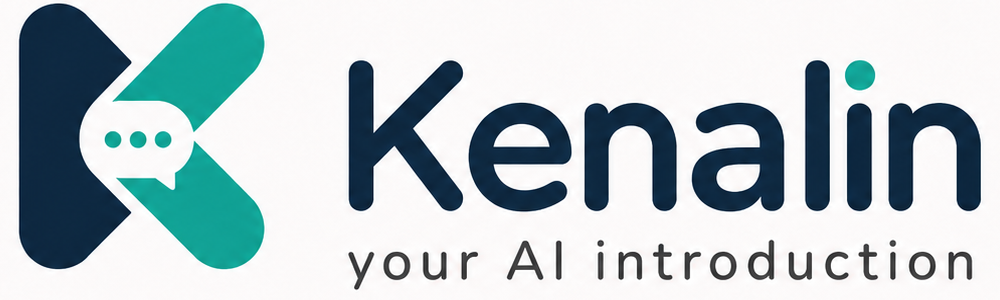

<a id="readme-top"></a>

<div align="center">



<br />

**The website that introduces itself.** An open-source, embeddable AI assistant you
drop into any site with one `<script>` tag — it answers from your own content, cites
every source, and routes real leads to a human.

[](https://kenalin.vercel.app)
[](https://www.npmjs.com/package/@kenalin/widget)
[](https://github.com/aldianriski/kenalin/actions/workflows/ci.yml)
[](LICENSE)
[](packages/widget)
[](docs/adr/ADR-003-gemini-sole-mvp-provider.md)
[](docs/adr/ADR-004-stateless-no-db-default.md)

<br />

### ▶ [Try the live demo →](https://kenalin.vercel.app) · the chat in the corner *is* Kenalin, explaining itself

</div>

---

Kenalin turns a static page into a guided conversation: it answers visitor
questions from **your own content** — who you are, what you've built, what's
relevant — always backed by curated evidence with source links, and routes
meaningful intent (hiring, a business opportunity) to a human via configured
channels (WhatsApp, email, calendar, webhook). **One `<script>` tag. One config
file. No database required for a fresh install.**

> **See it live:** [kenalin.vercel.app](https://kenalin.vercel.app) runs Kenalin on
> itself — the assistant's knowledge is the docs about Kenalin, so every answer is
> grounded and cited. The whole page is a live demo of the embedded widget.

## Why Kenalin
- **Easy to adopt** — one `<script>`, an `npx create-kenalin` scaffold, or the
  `@kenalin/*` packages. Live in minutes, no lock-in.
- **Fully customizable** — brand colors per light/dark, swap every icon, set the
  persona, toggle modules — adapt it to your site without forking.
- **Evidence-grounded** — every answer cites a source from your own content; no
  evidence → it says so, it never fabricates.
- **Private & self-hosted** — MIT-licensed, runs on your own infrastructure. No
  database for a fresh install, secrets stay in your env. Speaks EN & ID.

## What It Is Not
- Not a generic ChatGPT/customer-service widget, and never impersonates the owner.
- Not an autonomous sales agent, CRM, or multi-tenant SaaS — the webhook is the boundary.
- Never states prices, claims availability, or invents URLs (see [safety policy](docs/PRD.md#b9-safety-requirements-non-overridable-policy-set)).

## Requirements
- Node.js ≥ 20 to run a Kenalin app (≥ 22 to develop this monorepo — pnpm 11 needs it).
- pnpm ≥ 11 (monorepo).
- A Google Gemini API key (chat `gemini-2.5-flash` + embeddings `gemini-embedding-001`).
  The hosted [demo](https://kenalin.vercel.app) is **keyless** — retrieval is real, answers
  come from a deterministic responder — so you can try the UX with no key at all.

## Quickstart

Scaffold a runnable project in under 5 minutes:

```bash
npx create-kenalin my-site
cd my-site && npm install
cp .env.example .env          # add your Gemini key as KENALIN_LLM_API_KEY
npm run ingest                # build the knowledge index from content/
npm run dev                   # http://localhost:8787
```

Open <http://localhost:8787> and click the launcher. Then edit `kenalin.config.ts`
and `content/`, and re-run `npm run ingest`.

<sub>The `@kenalin/*` packages publish with **v0.6**. Prefer to work from source? →
`git clone https://github.com/aldianriski/kenalin && cd kenalin && pnpm install && pnpm build`</sub>

Full setup: [`docs/SETUP.md`](docs/SETUP.md) · every config field:
[`docs/CONFIG.md`](docs/CONFIG.md)

## Embed

```html
<!-- one tag, anywhere on the page -->
<script src="https://unpkg.com/@kenalin/widget/dist/kenalin.js"
        data-api-url="https://your-site.example" defer></script>
```

The `<kenalin-ai>` Web Component mounts a Shadow-DOM-isolated assistant, themeable
via CSS custom properties on the element. See the [design system](docs/DESIGN.md).

**Integration guides:** [Next.js](docs/integration/nextjs.md) ·
[plain HTML](docs/integration/plain-html.md)

## Usage

| Command / entry point | When |
|---|---|
| `pnpm build` | Build all packages (`core`, `server`, `widget`) |
| `pnpm ingest` | Build the local knowledge index from your configured sources |
| `pnpm verify` | Owner-string gate + typecheck + build + tests |
| `pnpm eval` | Run the scenario eval matrix (PRD Part H) |
| `<script src=".../kenalin.js">` | Embed the assistant on any host page |

## Architecture

A modular pnpm monorepo with one stateless orchestration flow:

```
packages/core     pure TS — schemas, config, orchestrator, prompt, policies, interfaces
packages/server   Hono API, Gemini providers, local index, ingest CLI  (all I/O here)
packages/widget   Preact Web Component + <script> embed  (talks only to /api/chat)
```

More: [Architecture](docs/ARCHITECTURE.md) · [Config reference](docs/CONFIG.md) · [Decisions (ADRs)](docs/DECISIONS.md) · [Design system](docs/DESIGN.md) · [PRD](docs/PRD.md)

## Brand

<div align="center">

| | |
|---|---|
| **Navy** `#0F2742` | **Teal** `#22B8A7` |
| **Soft teal** `#8DE2D4` | **Amber** `#D99A2B` |

</div>

Type: **Inter**. The full system — colors, type scale, icon set, component library,
and interaction cues — lives in [`assets/design/guideline.png`](assets/design/guideline.png)
and is documented in [`docs/DESIGN.md`](docs/DESIGN.md).

## Roadmap

Same **Now / Next / Later** view as the [live demo](https://kenalin.vercel.app):

- **Now** — real retrieval over your content, Redis-backed caching + rate limiting,
  token/context budgets, bilingual EN/ID, one-script + npm embed. *(shipped)*
- **Next** — explicit context caching, structured/graph-aware knowledge, real token streaming.
- **Later** — a learning loop from real conversations, a no-code config studio, more
  model providers (Anthropic, OpenAI).

Full detail: [ROADMAP.md](ROADMAP.md).

## Contributing

Contributions welcome — see [CONTRIBUTING.md](CONTRIBUTING.md) and the
[Code of Conduct](CODE_OF_CONDUCT.md).

## License
MIT — see [LICENSE](LICENSE).

<sub>Doc owner: Tech Lead · last updated: 2026-07-07 · status: current</sub>
